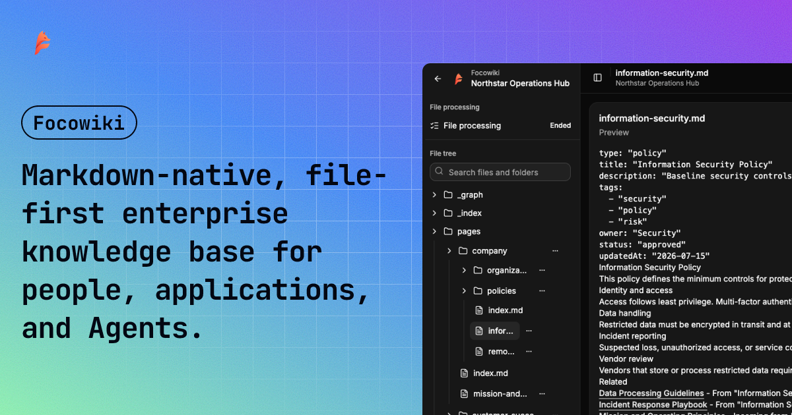
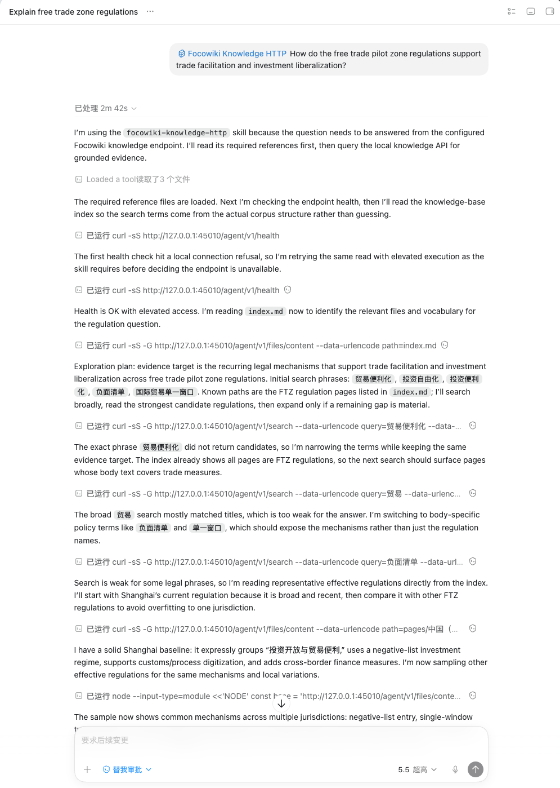
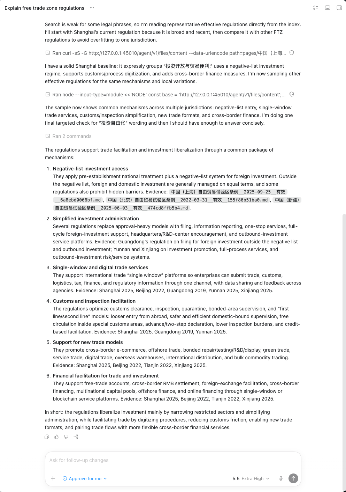

<p align="center">
  
</p>

<h1 align="center">Focowiki</h1>

<p align="center">
  <strong>Markdown-native, file-first enterprise knowledge base for people, applications, and Agents.</strong>
</p>

<p align="center">
  <a href="https://github.com/farozerolabs/focowiki/releases"></a>
  <a href="./LICENSE"></a>
  <a href="https://github.com/farozerolabs/focowiki/pkgs/container/focowiki-api"></a>
  <a href="https://docs.focowiki.com"></a>
  <a href="https://docs.focowiki.com/openapi/"></a>
</p>

<p align="center">
  <a href="https://docs.focowiki.com">Documentation</a>
  · <a href="https://docs.focowiki.com/deployment/docker-compose">Docker Compose</a>
  · <a href="https://docs.focowiki.com/openapi/">Developer OpenAPI</a>
  · <a href="https://docs.focowiki.com/agent-integration/">Agent Integration</a>
  · <a href="https://docs.focowiki.com/guide/file-cleaning-ingestion">File Cleaning Guide</a>
</p>

<p align="center">
  English · <a href="./README.zh-CN.md">中文</a>
</p>

Focowiki turns cleaned Markdown files into an OKF-style knowledge base for people, applications, and Agents. It follows Google's Open Knowledge Format approach, which builds on Andrej Karpathy's LLM-Wiki concept: knowledge should be organized as readable files with metadata, links, indexes, and update logs.

We tested RAG-style search first. Chunk recall often missed document context, cross-file relationships, update status, and domain structure. It also required repeated tuning of embeddings, rerankers, and chunking strategies for each dataset. That led us toward a file-first knowledge base system.

Focowiki uses readable Markdown as the core knowledge representation. It preserves metadata, generates indexes and graph files, records related links, and gives Agents a corpus they can explore in a loop: read the index, open files, follow leads, search again, compare evidence, and answer with cited sources.


## Quick Start

Run Focowiki with Docker Compose and the published images on GHCR.

Before installing Focowiki, make sure your machine meets these requirements:

- Minimum: CPU >= 2 cores, RAM >= 2 GiB
- Recommended: CPU >= 2 cores, RAM >= 4 GiB or more

```bash
git clone https://github.com/farozerolabs/focowiki.git && cd focowiki
cp .env.example .env
cp docker-compose.yml.example docker-compose.yml
docker compose -f docker-compose.yml pull
docker compose -f docker-compose.yml run --rm migrate
docker compose -f docker-compose.yml up -d
```

### Agent-assisted Deployment

If you use Codex, Claude Code, or a similar coding agent, you can ask it to read this repository and help deploy Focowiki with Docker Compose.

```text
Review the farozerolabs/focowiki repository:
https://github.com/farozerolabs/focowiki

Read README.md and help me deploy Focowiki with Docker Compose.
```

The Docker Compose template uses `latest` by default. To pin a release, set the image tags in `.env`:

```env
FOCOWIKI_API_IMAGE=ghcr.io/farozerolabs/focowiki-api:0.1.0
FOCOWIKI_ADMIN_IMAGE=ghcr.io/farozerolabs/focowiki-admin:0.1.0
```

Read the [Docker Compose deployment guide](https://docs.focowiki.com/deployment/docker-compose) for configuration details.

## Documentation

Full documentation is available at [docs.focowiki.com](https://docs.focowiki.com).

- [Project introduction](https://docs.focowiki.com/)
- [Docker Compose deployment](https://docs.focowiki.com/deployment/docker-compose)
- [Agent-assisted deployment](https://docs.focowiki.com/deployment/agent-deployment)
- [Developer OpenAPI](https://docs.focowiki.com/openapi/)
- [Agent integration](https://docs.focowiki.com/agent-integration/)
- [Open Knowledge Format guide](https://docs.focowiki.com/guide/open-knowledge-format)
- [File-first graph guide](https://docs.focowiki.com/guide/file-first-graph)
- [File cleaning and ingestion guide](https://docs.focowiki.com/guide/file-cleaning-ingestion)

## What Focowiki Provides

- Markdown-only upload workflow for `.md` files.
- Frontmatter, headings, links, and body content extraction.
- OKF-style files: `index.md`, `log.md`, `schema.md`, `pages/*.md`, `_index/*.json`, and `_graph/*`.
- PostgreSQL records, Redis coordination, and S3-compatible file storage.
- Isolated source-processing, publication, and maintenance Worker roles with durable database-backed progress.
- Admin UI for knowledge-base management, uploads, file browsing, processing status, and OpenAPI keys.
- Developer OpenAPI for backend and Agent integration.

## Admin UI Preview


## Agent Demo Result

The demo shows a third-party Agent reading a Focowiki-backed legal knowledge base through a demo backend and Skill.





See the [Agent demo result documentation](https://docs.focowiki.com/agent-integration/demo-agent-result) for the integration context.

## Why File-First

[Google's Open Knowledge Format announcement](https://cloud.google.com/blog/products/data-analytics/how-the-open-knowledge-format-can-improve-data-sharing/) describes a portable way to represent knowledge as Markdown files with YAML frontmatter. The [pinned OKF v0.1 specification](https://github.com/GoogleCloudPlatform/knowledge-catalog/blob/ee67a5ca27044ebe7c38385f5b6cffc2305a9c1a/okf/SPEC.md) defines metadata, Markdown pages, links, indexes, and update logs.

Focowiki turns this model into an open-source product workflow. Teams upload cleaned Markdown files, Focowiki parses document signals, generates an OKF-style knowledge base, stores every generated file, and exposes the result through the Admin UI and Developer OpenAPI.

## Markdown Input

Uploads accept `.md` files only. A Markdown file can include YAML frontmatter followed by Markdown body content.

```md
---
type: "page"
title: "Customer Support Playbook"
description: "How the support team handles priority customer requests."
resource: "https://example.com/docs/support-playbook"
tags:
  - support
  - operations
timestamp: "2026-06-16T00:00:00Z"
---

# Customer Support Playbook

Use this playbook when a priority customer request arrives.
```

Additional safe frontmatter fields can be preserved as pass-through metadata. Detailed input guidance is documented in the [project introduction](https://docs.focowiki.com/).

## Local Development

Focowiki uses pnpm, TypeScript, Vite, React, Hono, PostgreSQL, Redis, and S3-compatible storage.

```bash
pnpm install
cp .env.dev.example .env
cp docker-compose.local.yml.example docker-compose.local.yml
docker compose -f docker-compose.local.yml up -d postgres redis
pnpm --filter @focowiki/api db:migrate
pnpm dev
```

Local service URLs:

- Admin UI: `http://127.0.0.1:43100`
- Admin API: `http://127.0.0.1:43000`
- Developer OpenAPI: `http://127.0.0.1:43200`

Parsing real uploads requires S3-compatible storage settings in `.env`.

## License

Focowiki is distributed under a modified Apache License 2.0. See [LICENSE](./LICENSE).

## References

- [Open Knowledge Format announcement](https://cloud.google.com/blog/products/data-analytics/how-the-open-knowledge-format-can-improve-data-sharing/)
- [OKF v0.1 specification, pinned revision](https://github.com/GoogleCloudPlatform/knowledge-catalog/blob/ee67a5ca27044ebe7c38385f5b6cffc2305a9c1a/okf/SPEC.md)
- [Focowiki documentation](https://docs.focowiki.com)

<p><sub><small>Related links: <a href="https://linux.do/">linux.do</a> · <a href="https://www.v2ex.com/">V2EX</a></small></sub></p>
