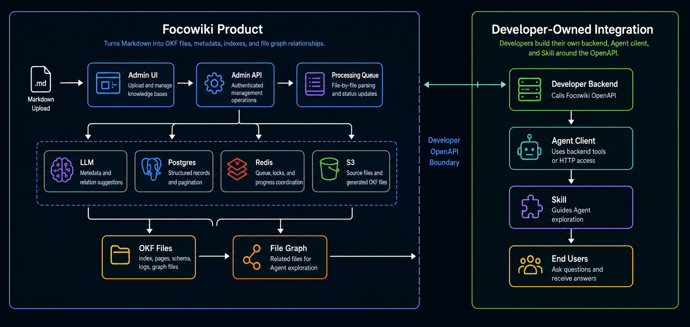
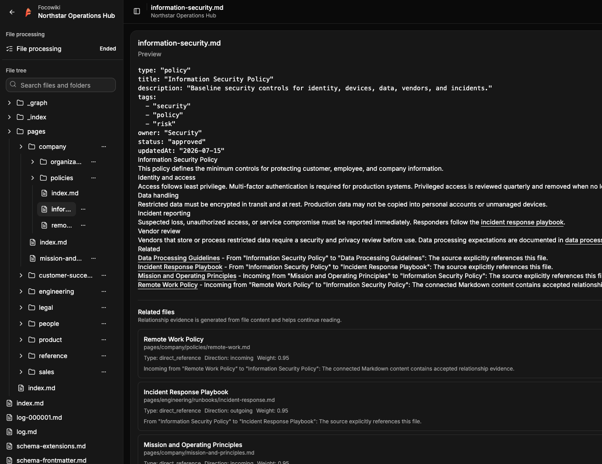
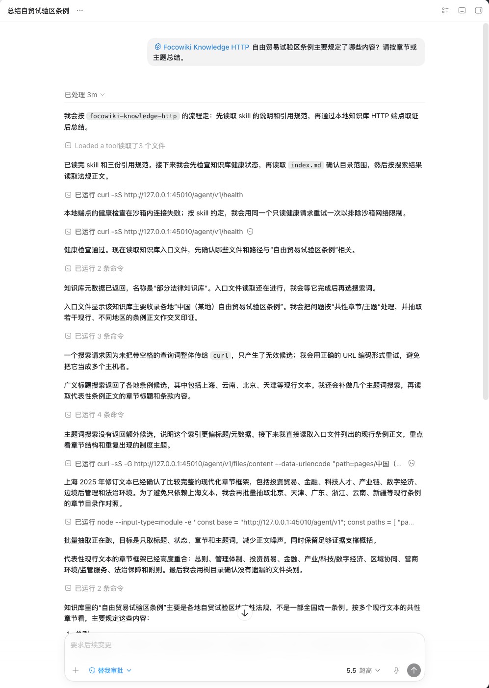
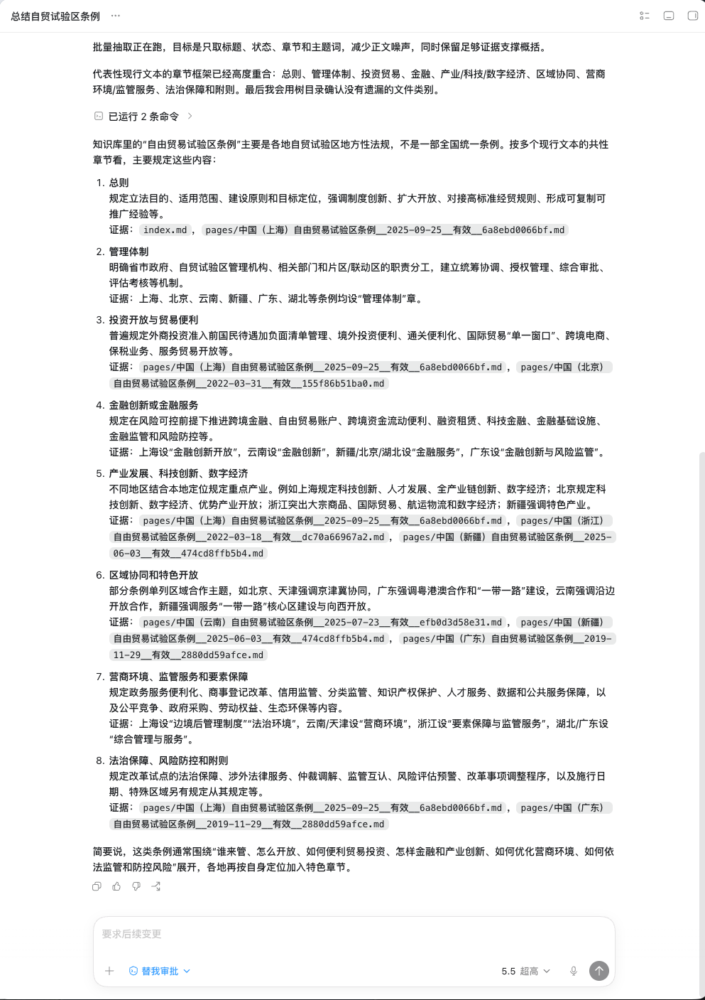

<p align="center">
  
</p>

<h1 align="center">Focowiki</h1>

<p align="center">
  <strong>以 Markdown 文件优先的企业知识库系统，面向人、应用和 Agent。</strong>
</p>

<p align="center">
  <a href="https://github.com/farozerolabs/focowiki/releases"></a>
  <a href="./LICENSE"></a>
  <a href="https://github.com/farozerolabs/focowiki/pkgs/container/focowiki-api"></a>
  <a href="https://docs.focowiki.com/zh-CN/"></a>
  <a href="https://docs.focowiki.com/zh-CN/openapi/"></a>
</p>

<p align="center">
  <a href="https://docs.focowiki.com/zh-CN/">文档</a>
  · <a href="https://docs.focowiki.com/zh-CN/deployment/docker-compose">Docker Compose</a>
  · <a href="https://docs.focowiki.com/zh-CN/openapi/">Developer OpenAPI</a>
  · <a href="https://docs.focowiki.com/zh-CN/agent-integration/">Agent 接入</a>
  · <a href="https://docs.focowiki.com/zh-CN/guide/file-cleaning-ingestion">文件清洗指南</a>
</p>

<p align="center">
  中文 · <a href="./README.md">English</a>
</p>

Focowiki 把清洗后的 Markdown 文件生成 OKF-style 知识库，让人、应用和 Agent 都可以通过文档化的产品接口读取。它遵循 Google Open Knowledge Format 的方向，也延续 Andrej Karpathy 的 LLM-Wiki 概念：知识应该以可阅读文件、元数据、链接、索引和更新日志来组织。

我们最开始用 RAG 思路验证搜索，发现 chunk 召回容易漏掉文档整体上下文、跨文件关系、更新状态和领域结构。传统 RAG 知识库还需要为不同数据反复调试 embedding、reranker 和 chunk 切分策略。

Focowiki 使用可阅读的 Markdown 作为核心知识表示。系统保留元数据，生成索引和图关系文件，记录关联链接，并让 Agent 围绕资料库组织 Loop：读取索引、打开文件、抽取线索、继续检索、比对证据，并基于来源回答。



## 快速启动

使用 Docker Compose 和已发布的 GHCR 镜像启动 Focowiki。

安装 Focowiki 前，请确认机器满足以下要求：

- 最小配置：CPU >= 2 Core，RAM >= 2 GiB
- 推荐配置：CPU >= 2 Core，RAM >= 4 GiB 或更高

```bash
cp .env.example .env
cp docker-compose.yml.example docker-compose.yml
docker compose -f docker-compose.yml pull
docker compose -f docker-compose.yml run --rm migrate
docker compose -f docker-compose.yml up -d
```

### 使用 Agent 部署

如果使用 Codex、Claude Code 或类似的 coding Agent，可以让 Agent 阅读这个仓库并协助使用 Docker Compose 部署 Focowiki。

```text
查看 farozerolabs/focowiki 仓库：
https://github.com/farozerolabs/focowiki

阅读 README.md，帮我使用 Docker Compose 部署 Focowiki。
```

Docker Compose 模板默认使用 `latest`。若需固定版本，在 `.env` 中指定镜像 tag：

```env
FOCOWIKI_API_IMAGE=ghcr.io/farozerolabs/focowiki-api:0.1.0
FOCOWIKI_ADMIN_IMAGE=ghcr.io/farozerolabs/focowiki-admin:0.1.0
```

配置细节和运行命令见 [Docker Compose 部署文档](https://docs.focowiki.com/zh-CN/deployment/docker-compose)。

## 文档

完整文档见 [docs.focowiki.com](https://docs.focowiki.com)。

- [项目介绍](https://docs.focowiki.com/zh-CN/)
- [Docker Compose 部署](https://docs.focowiki.com/zh-CN/deployment/docker-compose)
- [使用 Agent 部署](https://docs.focowiki.com/zh-CN/deployment/agent-deployment)
- [Developer OpenAPI](https://docs.focowiki.com/zh-CN/openapi/)
- [Agent 接入](https://docs.focowiki.com/zh-CN/agent-integration/)
- [Open Knowledge Format 指南](https://docs.focowiki.com/zh-CN/guide/open-knowledge-format)
- [文件优先图关系指南](https://docs.focowiki.com/zh-CN/guide/file-first-graph)
- [文件清洗入库指南](https://docs.focowiki.com/zh-CN/guide/file-cleaning-ingestion)

## Focowiki 提供什么

- 只接收 `.md` 文件的 Markdown 上传流程。
- Frontmatter、标题、链接和正文内容提取。
- OKF-style 文件：`index.md`、`log.md`、`schema.md`、`pages/*.md`、`_index/*.json` 和 `_graph/*`。
- PostgreSQL 记录、Redis 协调和 S3 兼容文件存储。
- Admin UI，用于知识库管理、上传、文件浏览、处理状态和 OpenAPI key。
- Developer OpenAPI，用于后端和 Agent 集成。

## Admin UI 预览



## Agent Demo 运行结果

Demo Agent 运行结果展示了第三方 Agent 通过 demo 后端和 Skill 读取 Focowiki 法律知识库并回答问题。





查看 [Agent Demo 运行结果文档](https://docs.focowiki.com/zh-CN/agent-integration/demo-agent-result) 了解接入上下文。

## 为什么文件优先

[Google 的 Open Knowledge Format 公告](https://cloud.google.com/blog/products/data-analytics/how-the-open-knowledge-format-can-improve-data-sharing/) 描述了一种基于 Markdown 文件和 YAML frontmatter 的可移植知识表示方式。[OKF specification](https://github.com/GoogleCloudPlatform/knowledge-catalog/blob/main/okf/SPEC.md) 定义了 metadata、Markdown pages、links、indexes 和 update logs。

Focowiki 把这个模型实现为开源产品流程。团队上传清洗后的 Markdown 文件，Focowiki 解析文档信号，生成 OKF-style 知识库，保存每一个生成文件，并通过 Admin UI 和 Developer OpenAPI 暴露结果。

## Markdown 输入

上传只接受 `.md` 文件。Markdown 文件可以包含 YAML frontmatter，后面跟 Markdown 正文。

```md
---
type: "page"
title: "Customer Support Playbook"
description: "How the support team handles priority customer requests."
resource: "https://example.com/docs/support-playbook"
tags:
  - support
  - operations
timestamp: "2026-06-16T00:00:00Z"
---

# Customer Support Playbook

Use this playbook when a priority customer request arrives.
```

额外的安全 frontmatter 字段可以作为 pass-through metadata 保留。详细输入说明见 [项目介绍](https://docs.focowiki.com/zh-CN/)。

## 本地开发

Focowiki 使用 pnpm、TypeScript、Vite、React、Hono、PostgreSQL、Redis 和 S3 兼容存储。

```bash
pnpm install
cp .env.dev.example .env
cp docker-compose.local.yml.example docker-compose.local.yml
docker compose -f docker-compose.local.yml up -d postgres redis
pnpm --filter @focowiki/api db:migrate
pnpm dev
```

本地服务地址：

- Admin UI：`http://127.0.0.1:43100`
- Admin API：`http://127.0.0.1:43000`
- Developer OpenAPI：`http://127.0.0.1:43200`

真实上传解析需要在 `.env` 中配置 S3 兼容存储。

## License

Focowiki 使用 modified Apache License 2.0 发布。见 [LICENSE](./LICENSE)。

## References

- [Open Knowledge Format announcement](https://cloud.google.com/blog/products/data-analytics/how-the-open-knowledge-format-can-improve-data-sharing/)
- [OKF v0.1 specification](https://github.com/GoogleCloudPlatform/knowledge-catalog/blob/main/okf/SPEC.md)
- [Focowiki documentation](https://docs.focowiki.com)
