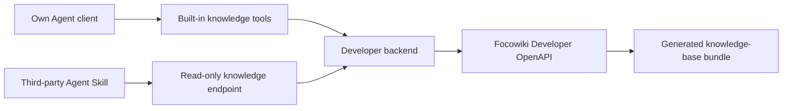

# Agent Integration

Focowiki exposes knowledge-base data through Developer OpenAPI. Agent products usually add an application backend that stores the Focowiki OpenAPI key, selects the knowledge base, and exposes a small read-focused interface for Agent access.

This section explains two integration modes:

| Mode | When to use | Agent access shape |
| --- | --- | --- |
| Own Agent client | You control the Agent runtime and can register built-in tools. | The Agent calls developer-registered tools such as `list_tree`, `read_file`, `get_file`, and `search_files`. |
| Third-party Agent client | The Agent client supports instructions and HTTP access, but cannot register your built-in tools. | The Skill sends HTTP requests to a developer-provided read-only knowledge endpoint. |

## Recommended Architecture

The backend is the control point. It stores the Developer OpenAPI base URL and key, maps product users to allowed knowledge bases, and decides which read operations are available to the Agent.

The Agent, Skill, or built-in tool should call only the developer-controlled interface. The Focowiki OpenAPI key stays in the backend.

## What The Backend Uses

The backend usually calls these Focowiki interfaces:

| Purpose | Developer OpenAPI operation |
| --- | --- |
| Resolve available knowledge bases | `listKnowledgeBases` |
| Create and maintain knowledge bases | `createKnowledgeBase`, `updateKnowledgeBase`, `deleteKnowledgeBase` |
| Upload Markdown files and folders | `createUploadSession`, `addUploadManifestEntries`, `sealUploadManifest`, `uploadSessionContentBatch`, `getUploadSession`, `finalizeUploadSession` |
| Observe source-file processing | `listKnowledgeBaseSourceFiles`, `getKnowledgeBaseSourceFile`, `listKnowledgeBaseSourceFileEvents`, `retryKnowledgeBaseSourceFile` |
| Maintain source files and directories | `moveSourceFile`, `replaceSourceFileContent`, `deleteSourceFile`, `listSourceDirectories`, `moveSourceDirectory`, `deleteSourceDirectory` |
| Observe asynchronous changes | `listResourceOperations`, `getResourceOperation` |
| Read the generated file tree | `listKnowledgeBaseTree` |
| Read file metadata | `getFileById` |
| Read file content by stable identifier | `getFileContentById` |
| Read file content by logical path | `getFileContentByPath` |
| Search and explore related files | `searchGeneratedFiles`, `listRelatedFiles`, `expandGraph`, `getGraphOverview` |
| Manage webhooks | `listWebhooks`, `createWebhook`, `deleteWebhook`, `listWebhookDeliveries`, `redeliverWebhook` |

These operations are for the developer backend and product workflows. The Agent-facing interface should stay read-focused by default. Expose write or delete capabilities to an Agent only when the product explicitly needs Agent-driven maintenance.

## What The Backend Exposes To The Agent

A minimal Agent-facing backend can expose these operations. In an own Agent client, these are built-in tools. In a third-party Agent client, these are HTTP endpoints on a read-only knowledge base URL.

| Agent-facing operation | Purpose |
| --- | --- |
| `list_tree` | Return paginated generated file entries for one selected knowledge base. |
| `read_file` | Return Markdown content by `fileId` or logical `path`. |
| `get_file` | Return safe metadata for a file. |
| `search_files` | Optional candidate lookup for Agent-generated search phrases, backed by `searchGeneratedFiles` or your own read layer. |
| `read_related` | Optional shortcut for related files. Agents can also follow the `graphRef` returned with a generated page. |
| `expand_graph` | Optional relationship exploration from a file or query, backed by Developer OpenAPI graph expansion. |

Keep this interface small. Agents work better when they can discover a file tree, read one file, follow links, and repeat the loop.

## Mode-specific Shape

| Mode | Interface example |
| --- | --- |
| Own Agent client | `curl -sS -G "$KNOWLEDGE_BASE_URL/tree" --data-urlencode "limit=50"`, `curl -sS "$KNOWLEDGE_BASE_URL/files/{fileId}/content"` |
| Third-party Agent client | `curl -sS -G "$KNOWLEDGE_BASE_URL/files/content" --data-urlencode "path=index.md"`, `curl -sS -G "$KNOWLEDGE_BASE_URL/search" --data-urlencode "query=<agent-generated phrase>"` |

## Exploration Flow

Agent reads should run as a small loop with broad discovery, deep file reading, lead extraction, and evidence checks before answering.

1. Start with `index.md`, then read `schema.md` when file conventions or metadata are unclear.
2. Inspect the file tree and `_index/*` when generated index, link, manifest, or directory hints can narrow the next read.
3. Discover candidate files through search, tree entries, graph expansion, graph files, related files, or Markdown links.
4. Read useful candidates by `fileId` or logical `path`.
5. Extract new phrases, paths, links, titles, headings, metadata terms, graph relations, and remaining gaps from the files read.
6. Repeat breadth and depth while new leads can add useful evidence.
7. Track visited `fileId` and `path` values.
8. Stop after the collected evidence covers the user's scope, no new relevant candidates remain for the remaining gap, or additional rounds repeat already-visited files.

This keeps requests predictable while reducing shallow answers from one-file reads.

## Next Steps

- [Backend Adapter](./backend-adapter.md)
- [Own Agent Client Tools Design](./own-agent-client/tools-design.md)
- [Own Agent Client Skill Design](./own-agent-client/skill-design.md)
- [Third-party Agent Client Skill Design](./third-party-agent-client/skill-design.md)
- [Demo Agent Result](./demo-agent-result.md)
