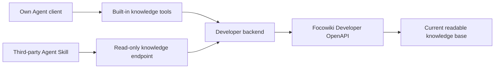

# Agent Integration

Focowiki exposes knowledge-base data through Developer OpenAPI. Agent products usually add an application backend that stores the Focowiki OpenAPI key, selects the knowledge base, and exposes a small read-focused interface for Agent access.

This section explains two integration modes:

| Mode | When to use | Agent access shape |
| --- | --- | --- |
| Own Agent client | You control the Agent runtime and can register built-in tools. | The Agent calls developer-registered tools such as `list_tree`, `read_file`, `get_file`, and `search_files`. |
| Third-party Agent client | The Agent client supports instructions and HTTP access, but cannot register your built-in tools. | The Skill sends HTTP requests to a developer-provided read-only knowledge endpoint. |

## Recommended Architecture

```mermaid
flowchart LR
  OwnAgent["Own Agent client"] --> Tools["Built-in knowledge tools"]
  ThirdParty["Third-party Agent Skill"] --> Endpoint["Read-only knowledge endpoint"]
  Tools --> Backend["Developer backend"]
  Endpoint --> Backend
  Backend --> OpenAPI["Focowiki Developer OpenAPI"]
  OpenAPI --> Knowledge["Current readable knowledge base"]
```

The backend is the control point. It stores the Developer OpenAPI base URL and key, maps product users to allowed knowledge bases, and decides which read operations are available to the Agent.

The Agent, Skill, or built-in tool should call only the developer-controlled interface. The Focowiki OpenAPI key stays in the backend.

## What The Backend Uses

The backend usually calls these Focowiki interfaces:

| Purpose | Developer OpenAPI operation |
| --- | --- |
| Resolve available knowledge bases | `listKnowledgeBases` |
| Create and maintain knowledge bases | `createKnowledgeBase`, `updateKnowledgeBase`, `deleteKnowledgeBase` |
| Upload Markdown files and folders | `createUploadSession`, `addUploadManifestEntries`, `sealUploadManifest`, `uploadSessionEntryContent`, `getUploadSession`, `finalizeUploadSession` |
| Observe source-file processing | `listKnowledgeBaseSourceFiles`, `getKnowledgeBaseSourceFile`, `retryKnowledgeBaseSourceFile` |
| Maintain source files and directories | `moveSourceFile`, `replaceSourceFileContent`, `deleteSourceFile`, `listSourceDirectories`, `moveSourceDirectory`, `deleteSourceDirectory` |
| Observe asynchronous changes | `listResourceOperations`, `getResourceOperation` |
| Read the current file tree | `listKnowledgeBaseTree` |
| Read file metadata | `getFileById` |
| Read file content by stable identifier | `getFileContentById` |
| Read file content by logical path | `getFileContentByPath` |
| Search and explore related files | `searchGeneratedFiles`, `listRelatedFiles`, `expandGraph`, `getGraphOverview` |
| Manage webhooks | `listWebhooks`, `createWebhook`, `deleteWebhook`, `listWebhookDeliveries`, `redeliverWebhook` |

These operations are for the developer backend and product workflows. The Agent-facing interface should stay read-focused by default. Expose write or delete capabilities to an Agent only when the product explicitly needs Agent-driven maintenance.

## What The Backend Exposes To The Agent

A minimal Agent-facing backend can expose these operations. In an own Agent client, these are built-in tools. In a third-party Agent client, these are HTTP endpoints on a read-only knowledge base URL.

| Agent-facing operation | Purpose |
| --- | --- |
| `list_tree` | Return paginated current file and directory entries for one selected knowledge base. |
| `read_file` | Return Markdown content by `fileId` or logical `path`. |
| `get_file` | Return safe metadata for a file. |
| `search_files` | Primary candidate discovery for a complete standalone question, backed by `searchGeneratedFiles` or an equivalent read layer. |
| `read_related` | Optional shortcut for related files. Agents can also follow the returned `graphRef`. |
| `expand_graph` | Optional relationship exploration from a returned `fileId`, backed by Developer OpenAPI graph expansion. |

Keep this interface small. Agents work better when they can discover a file tree, read one file, follow links, and repeat the loop.

## Mode-specific Shape

| Mode | Interface example |
| --- | --- |
| Own Agent client | `curl -sS -G "$KNOWLEDGE_BASE_URL/tree" --data-urlencode "limit=50"`, `curl -sS "$KNOWLEDGE_BASE_URL/files/{fileId}/content"` |
| Third-party Agent client | `curl -sS -G "$KNOWLEDGE_BASE_URL/files/content" --data-urlencode "path=index.md"`, `curl -sS -G "$KNOWLEDGE_BASE_URL/search" --data-urlencode "query=<complete standalone user question>"` |

## Exploration Flow

Uploads use resumable sessions only for transport. After finalization, every accepted Markdown document is indexed independently and can become readable without waiting for sibling documents. A source file is ready for Agent reads when `state` is `available` and `generatedOutputStatus` is `current_available`. A replacement failure can retain `previous_available` content.

Agent reads use one bounded source-first loop:

1. Send the complete standalone user question as one initial search and use default `hybrid` retrieval unless the task explicitly needs `file` or `graph` mode.
2. Treat every search item as a discovery candidate. Follow its returned `readActions` and read the useful source-backed Markdown under `pages/**`.
3. Preserve `activeContentRevision`, `fileId`, `path`, and `nextCursor`. Reuse a cursor only with the same query, filters, and readable content revision.
4. Track visited `fileId` and `path` values and never read the same source twice in one loop.
5. If source evidence remains incomplete, optionally use `listRelatedFiles` or call `expandGraph` with a returned `fileId`. Run at most two follow-up searches derived from terms, paths, links, headings, or gaps found in source Markdown already read.
6. Use `index.md` and the tree when the first search is empty or scope remains unclear. For a static exported bundle, `_index/**` is bounded discovery data and `_graph/**` describes file relationships; neither replaces the source Markdown.
7. Stop when source files cover the user's scope, no new relevant source remains, or the two follow-up rounds are complete.
8. Build the answer only from source-backed Markdown reads. Search snippets, navigation indexes, relationship records, and reranker output are discovery aids, not answer evidence.

This keeps requests predictable while reducing shallow answers from one-file reads.

## Next Steps

- [Backend Adapter](./backend-adapter.md)
- [Own Agent Client Tools Design](./own-agent-client/tools-design.md)
- [Own Agent Client Skill Design](./own-agent-client/skill-design.md)
- [Third-party Agent Client Skill Design](./third-party-agent-client/skill-design.md)
- [Demo Agent Result](./demo-agent-result.md)
