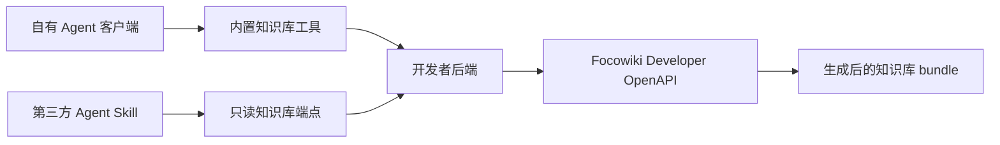

# Agent 接入

Focowiki 通过 Developer OpenAPI 暴露知识库数据。Agent 产品通常会增加一个开发者后端：这个后端保存 Focowiki OpenAPI key，选择知识库，并向 Agent 暴露一个小型读取接口。

本节说明两种接入模式：

| 模式 | 使用场景 | Agent 接入形态 |
| --- | --- | --- |
| 自有 Agent 客户端 | 开发者控制 Agent runtime，并且可以注册内置工具。 | Agent 调用开发者注册的 `list_tree`、`read_file`、`get_file`、`search_files` 等工具。 |
| 第三方 Agent 客户端 | Agent 客户端支持 instructions 和 HTTP access，但无法注册开发者自己的内置工具。 | Skill 通过 HTTP 请求访问开发者提供的只读知识库端点。 |

## 推荐架构

开发者后端是控制点。它保存 Developer OpenAPI base URL 和 key，将产品用户映射到允许访问的知识库，并决定 Agent 可以调用哪些读取能力。

Agent、Skill 或内置工具只调用开发者控制的接口。Focowiki OpenAPI key 保留在后端。

## 后端使用哪些接口

开发者后端通常调用这些 Focowiki 接口：

| 用途 | Developer OpenAPI operation |
| --- | --- |
| 解析可用知识库 | `listKnowledgeBases` |
| 创建和维护知识库 | `createKnowledgeBase`、`updateKnowledgeBase`、`deleteKnowledgeBase` |
| 上传 Markdown 文件和文件夹 | `createUploadSession`、`addUploadManifestEntries`、`sealUploadManifest`、`uploadSessionContentBatch`、`getUploadSession`、`finalizeUploadSession` |
| 观察源文件处理进度 | `listKnowledgeBaseSourceFiles`、`getKnowledgeBaseSourceFile`、`listKnowledgeBaseSourceFileEvents`、`retryKnowledgeBaseSourceFile` |
| 维护来源文件和目录 | `moveSourceFile`、`replaceSourceFileContent`、`deleteSourceFile`、`listSourceDirectories`、`moveSourceDirectory`、`deleteSourceDirectory` |
| 查看异步变更 | `listResourceOperations`、`getResourceOperation` |
| 读取生成文件树 | `listKnowledgeBaseTree` |
| 读取文件元数据 | `getFileById` |
| 按稳定标识读取文件内容 | `getFileContentById` |
| 按逻辑路径读取文件内容 | `getFileContentByPath` |
| 搜索和探索相关文件 | `searchGeneratedFiles`、`listRelatedFiles`、`expandGraph`、`getGraphOverview` |
| 管理 Webhook | `listWebhooks`、`createWebhook`、`deleteWebhook`、`listWebhookDeliveries`、`redeliverWebhook` |

这些接口服务于开发者后端和产品工作流。Agent-facing interface 默认保持读取为主。只有产品明确需要 Agent 维护知识库时，才向 Agent 暴露写入或删除能力。

## 后端向 Agent 暴露什么

最小可用的 Agent-facing backend 可以暴露这些操作。在自有 Agent 客户端中，它们表现为内置工具。在第三方 Agent 客户端中，它们表现为只读知识库 URL 下的 HTTP endpoints。

| Agent-facing operation | 用途 |
| --- | --- |
| `list_tree` | 返回一个知识库的分页生成文件条目。 |
| `read_file` | 按 `fileId` 或逻辑 `path` 返回 Markdown 内容。 |
| `get_file` | 返回文件的安全元数据。 |
| `search_files` | 可选候选查找操作，可由 `searchGeneratedFiles` 或你自己的读取层支持，查询短语由 Agent 生成。 |
| `read_related` | 可选的相关文件快捷接口。Agent 也可以跟随生成页面返回的 `graphRef`。 |
| `expand_graph` | 可选的关系探索操作，可以从文件或查询词继续探索。 |

接口保持小而稳定。Agent 可以发现文件树、读取单个文件、沿着链接继续探索，并重复这个过程。

## 不同模式的接口形态

| 模式 | 接口示例 |
| --- | --- |
| 自有 Agent 客户端 | `curl -sS -G "$KNOWLEDGE_BASE_URL/tree" --data-urlencode "limit=50"`、`curl -sS "$KNOWLEDGE_BASE_URL/files/{fileId}/content"` |
| 第三方 Agent 客户端 | `curl -sS -G "$KNOWLEDGE_BASE_URL/files/content" --data-urlencode "path=index.md"`、`curl -sS -G "$KNOWLEDGE_BASE_URL/search" --data-urlencode "query=<agent-generated phrase>"` |

## 探索流程

Agent 读取应采用小型循环，在回答前完成广度发现、深度阅读、线索提取和证据检查。

1. 从 `index.md` 开始，文件约定或 metadata 不清晰时读取 `schema.md`。
2. 在生成索引、链接、manifest 或目录线索有助于缩小范围时，检查文件树和 `_index/*`。
3. 通过搜索、文件树、图扩展、图文件、相关文件或 Markdown links 发现候选文件。
4. 按 `fileId` 或逻辑 `path` 读取有价值的候选文件。
5. 从已读文件中提取新的短语、路径、链接、标题、heading、metadata terms、图关系和剩余缺口。
6. 当新线索可以补充证据时，继续重复广度发现和深度阅读。
7. 记录已经访问过的 `fileId` 和 `path`。
8. 当已收集证据覆盖用户范围、剩余缺口没有新的相关候选，或后续轮次只会重复已读文件时停止。

这个流程可以保持请求可控，并减少浅层回答。

## 下一步

- [后端适配](./backend-adapter.md)
- [自有 Agent 客户端 Tools 设计](./own-agent-client/tools-design.md)
- [自有 Agent 客户端 Skill 设计](./own-agent-client/skill-design.md)
- [第三方 Agent 客户端 Skill 设计](./third-party-agent-client/skill-design.md)
- [Demo 运行测试结果示例](./demo-agent-result.md)
