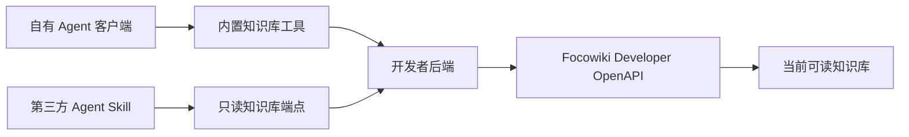

# Agent 接入

Focowiki 通过 Developer OpenAPI 提供知识库数据。Agent 产品通常会增加一个开发者后端：这个后端保存 Focowiki OpenAPI 密钥、选择知识库，并向 Agent 提供一个小型读取接口。

本节说明两种接入模式：

| 模式 | 使用场景 | Agent 接入形态 |
| --- | --- | --- |
| 自有 Agent 客户端 | 开发者控制 Agent 运行环境，并且可以注册内置工具。 | Agent 调用开发者注册的 `list_tree`、`read_file`、`get_file`、`search_files` 等工具。 |
| 第三方 Agent 客户端 | Agent 客户端可以执行指令并访问 HTTP，但无法注册开发者自己的内置工具。 | Skill 通过 HTTP 请求访问开发者提供的只读知识库端点。 |

## 推荐架构

```mermaid
flowchart LR
  OwnAgent["自有 Agent 客户端"] --> Tools["内置知识库工具"]
  ThirdParty["第三方 Agent Skill"] --> Endpoint["只读知识库端点"]
  Tools --> Backend["开发者后端"]
  Endpoint --> Backend
  Backend --> OpenAPI["Focowiki Developer OpenAPI"]
  OpenAPI --> Knowledge["当前可读知识库"]
```

开发者后端是控制点。它保存 Developer OpenAPI 基础 URL 和密钥，将产品用户映射到允许访问的知识库，并决定 Agent 可以调用哪些读取能力。

Agent、Skill 或内置工具只调用开发者控制的接口。Focowiki OpenAPI 密钥保留在后端。

## 后端使用哪些接口

开发者后端通常调用这些 Focowiki 接口：

| 用途 | Developer OpenAPI 操作 |
| --- | --- |
| 解析可用知识库 | `listKnowledgeBases` |
| 创建和维护知识库 | `createKnowledgeBase`、`updateKnowledgeBase`、`deleteKnowledgeBase` |
| 上传 Markdown 文件和文件夹 | `createUploadSession`、`addUploadManifestEntries`、`sealUploadManifest`、`uploadSessionEntryContent`、`getUploadSession`、`finalizeUploadSession` |
| 观察源文件处理进度 | `listKnowledgeBaseSourceFiles`、`getKnowledgeBaseSourceFile`、`retryKnowledgeBaseSourceFile` |
| 维护来源文件和目录 | `moveSourceFile`、`replaceSourceFileContent`、`deleteSourceFile`、`listSourceDirectories`、`moveSourceDirectory`、`deleteSourceDirectory` |
| 查看异步变更 | `listResourceOperations`、`getResourceOperation` |
| 读取当前文件树 | `listKnowledgeBaseTree` |
| 读取文件元数据 | `getFileById` |
| 按稳定标识读取文件内容 | `getFileContentById` |
| 按逻辑路径读取文件内容 | `getFileContentByPath` |
| 搜索和探索相关文件 | `searchGeneratedFiles`、`listRelatedFiles`、`expandGraph`、`getGraphOverview` |
| 管理 Webhook | `listWebhooks`、`createWebhook`、`deleteWebhook`、`listWebhookDeliveries`、`redeliverWebhook` |

这些接口服务于开发者后端和产品工作流。面向 Agent 的接口默认以读取为主。只有产品明确需要 Agent 维护知识库时，才向 Agent 暴露写入或删除能力。

## 后端向 Agent 暴露什么

最小可用的面向 Agent 后端可以暴露这些操作。在自有 Agent 客户端中，它们表现为内置工具；在第三方 Agent 客户端中，它们表现为只读知识库 URL 下的 HTTP 端点。

| 面向 Agent 的操作 | 用途 |
| --- | --- |
| `list_tree` | 返回一个知识库中当前可读的文件与目录分页。 |
| `read_file` | 按 `fileId` 或逻辑 `path` 返回 Markdown 内容。 |
| `get_file` | 返回文件的安全元数据。 |
| `search_files` | 使用完整独立问题发现候选的主要操作，可由 `searchGeneratedFiles` 或等价读取层支持。 |
| `read_related` | 可选的相关文件快捷接口。Agent 也可以跟随响应返回的 `graphRef`。 |
| `expand_graph` | 可选的关系探索操作，使用接口返回的 `fileId` 继续探索。 |

接口保持小而稳定。Agent 可以发现文件树、读取单个文件、沿着链接继续探索，并重复这个过程。

## 不同模式的接口形态

| 模式 | 接口示例 |
| --- | --- |
| 自有 Agent 客户端 | `curl -sS -G "$KNOWLEDGE_BASE_URL/tree" --data-urlencode "limit=50"`、`curl -sS "$KNOWLEDGE_BASE_URL/files/{fileId}/content"` |
| 第三方 Agent 客户端 | `curl -sS -G "$KNOWLEDGE_BASE_URL/files/content" --data-urlencode "path=index.md"`、`curl -sS -G "$KNOWLEDGE_BASE_URL/search" --data-urlencode "query=<完整独立的用户问题>"` |

## 探索流程

上传会话只负责可恢复的文件传输。完成上传会话后，每个文档独立索引，不需要等待同一会话内的其他文档；`state` 为 `available` 且 `generatedOutputStatus` 为 `current_available` 时即可供 Agent 读取。替换失败时可能继续保留 `previous_available` 内容。

Agent 读取采用一条有界的来源优先流程：

1. 第一次搜索发送用户的完整独立问题；除非任务明确需要 `file` 或 `graph`，否则使用默认 `hybrid` 检索。
2. 将所有搜索条目视为发现候选，跟随返回的 `readActions` 读取 `pages/**` 下有价值的来源 Markdown。
3. 保留 `activeContentRevision`、`fileId`、`path` 和 `nextCursor`。游标只能与相同查询、筛选条件和可读内容版本一起复用。
4. 记录已访问的 `fileId` 和 `path`，同一轮探索不重复读取同一来源。
5. 来源证据仍不完整时，可以使用 `listRelatedFiles`，或把返回的 `fileId` 传给 `expandGraph`。最多执行两轮由已读来源正文派生的后续搜索。
6. 第一次搜索为空或范围不清晰时读取 `index.md` 和文件树。读取静态导出知识库时，`_index/**` 是有界发现数据，`_graph/**` 描述文件关系；两者都不能替代来源正文。
7. 来源文件覆盖用户范围、没有新来源，或两轮后续搜索用完时停止。
8. 最终回答只能使用读取到的来源 Markdown；搜索摘要、导航索引、关系记录和重排模型输出仅用于发现，不能作为回答证据。

这个流程可以保持请求可控，并减少浅层回答。

## 下一步

- [后端适配](./backend-adapter.md)
- [自有 Agent 客户端 Tools 设计](./own-agent-client/tools-design.md)
- [自有 Agent 客户端 Skill 设计](./own-agent-client/skill-design.md)
- [第三方 Agent 客户端 Skill 设计](./third-party-agent-client/skill-design.md)
- [演示运行测试结果示例](./demo-agent-result.md)
